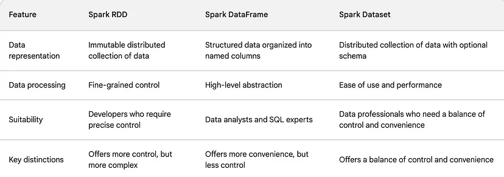
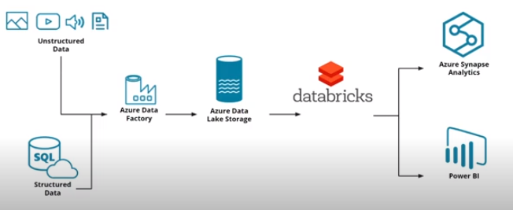
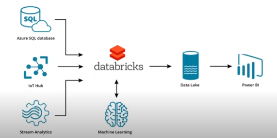
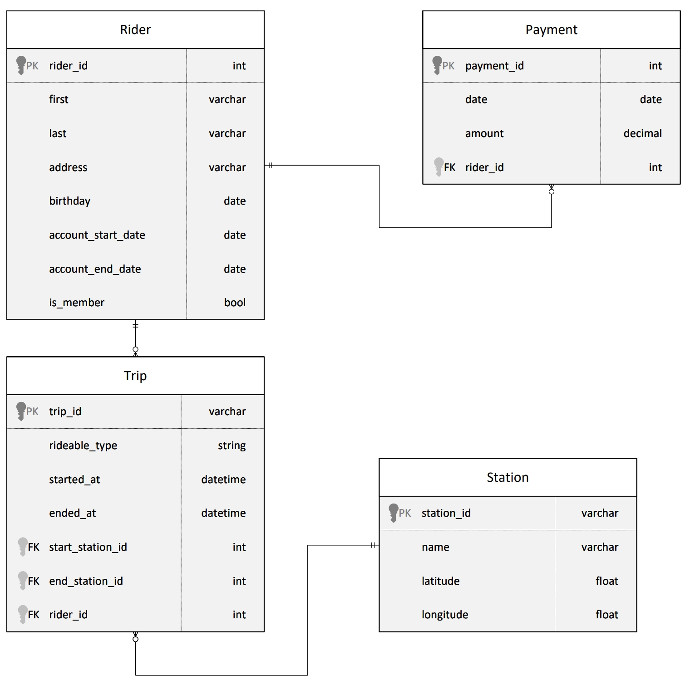

- [Introduction](#introduction)
- [Big Data Ecosystem, data lakes and spark](#big-data-ecosystem-data-lakes-and-spark)
- [Data Wrangling with Spark](#data-wrangling-with-spark)
- [Spark debugging and optimization](#spark-debugging-and-optimization)
- [Azure DataBricks](#azure-databricks)
- [Delta Lake](#delta-lake)
- [Project: Divvy bikeshare dataset](#project-divvy-bikeshare-dataset)

# Introduction

To use the provided databricks workspace

- only 10 attempts possible !!!
- need 5 min to start
- workspace has 8 cores, so you can pick
  - Single node: You can create a single-node cluster using the Standard_DS3_v2 or Standard_DS4_v2 SKU.
  - Multi node: You can create a two-node (one worker and one driver node) cluster using the Standard_DS3_v2 SKU.
  - enable autoscaling = No
  - terminate after 30mins of inactivity

# Big Data Ecosystem, data lakes and spark

Same content as in data engineer nanodegree. See my notes at https://github.com/cgebbe/udacity_data_engineer/blob/main/3_lakes/README.md

# Data Wrangling with Spark

NOTE: A lot of content still overlaps with data engineer nanodegree, see above.

Functional Programming

- Spark is written in Scala, which is a functional language
- Even though Spark has wrappers in python, the functional style still shows
- example function: `df.map(lambda s: s.lower()).collect()`

API: RDD / Dataframe / DataSets

- See https://www.databricks.com/blog/2016/07/14/a-tale-of-three-apache-spark-apis-rdds-dataframes-and-datasets.html
- see also https://spark.apache.org/docs/latest/api/python/index.html

Relevant functions (surprisingly similar to polars!)

- general
  - select
  - withColumn
  - filter (where)
  - groupBy
  - sort
  - DropDuplicates
- special functions
  - display
  - udf (user defined function)
  - sql
- aggregate
  - count
  - countDistinct
  - avg
  - max
  - min
  - agg({"salary": "avg", "age": "max"})
- window functions
  - paritionBy
  - rangeBetween
  - rowsBetween

# Spark debugging and optimization

Debugging is more difficult

- running Spark in "local mode" is easy
- but on remote machines in "standalone mode" and lazy collects more tricky (e.g. logs are longer and contain Java code)
- also, code running on a data subset, may fail on the full set due to e.g. NaNs or corrupt

Debugging using accumulators

- PROBLEM: Cannot use `print` in worker nodes.
- SOLUTION: Use special global variables called accumulators
- Example: `invalid_timestamp_counter`

Similar concept: broadcast variables

- also a kind of global variables shared among worker nodes, but read only

Problems that can occur due to data size

- PROBLEM: data skew = one worker has much more data than the other ones
  - SOLUTION1: Split differently (e.g. not by artist-name, but song-name or composite key)
  - SOLUTION2: Split s.t. chunk_count >> worker_count
- PROB: Insufficient resources (e.g. OOM)
- PROB: Poor queries (e.g. filter could be earlier)
  - See https://spark.apache.org/docs/latest/tuning.html
  - See https://spark.apache.org/docs/latest/sql-performance-tuning.html

# Azure DataBricks

= platform for analytics based on Spark based on

- DBFS storage (DataBricks FileSystem)
- spark clusters
- databricks workspace (including jupyter notebooks)
- also MLFlow ?!

Relation of DataBricks to other services

Setting up a databricks in Azure

- to create AzureDatabricks: simple via portal UI
- to launch databricks workspace: launch databricks workspace in overview tab
- to launch Spark cluster: in databricks workspace, compute, create cluster

DBFS vs AWS S3

- S3 similar to Azure Data Lake Storage (ADLS), which DBFS is based on (usually?!)
- DBFS additionally provides
  - file system abstraction (e.g. directories)
  - inegration with Databricks
  - integration with delta lake to make it a lakehouse (`saveAsTable` Spark function)

# Delta Lake

Azure data lake storage Gen2

- while Gen1 was a service, Gen2 is a set of capabilities on top of Azure Blob storage
  - hadoop access
  - hierarchical directory structure
  - scalable, cheap, fine-grain security

Delta Lake supports

- Azure Blob storage
- Azure data lake Gen 1
- Azure data lake Gen 2

How to use delta lake

- to save using file syntax
  - `df.write.format("delta").mode("overwrite").save("/delta/data)`
- to save using table syntax
  - `spark.sql("CREATE TABLE LoanData USING DELTA LOCATION '/delta/delta'")`
  - `df.write.format("delta").mode("append").saveAsTable("LoanData")`
- to read
  - `spark.read.format("delta").load("/delta/tablename")`
  - `spark.table("default.tablename")`

Data Processing stages

- bronze = raw
- silver = preprocessing and JOINing for e.g. data analysts
- gold = final data for BI

# Project: Divvy bikeshare dataset

Existing tables

Tasks

- design star schema
  - two fact tables
    - trip facts: rider age, trip duration
    - payment facts: payment amount
  - dimensions
    - station (only trip facts)
    - riders (both facts)
    - dates (both facts)
- extract: load from CSV
- load: create tables and inser into dela files using SQL statements to create tables (bronze)
- transform: to star schema mentioned above (gold)
- Answer question below?! (Maybe not even necessary?)

Questions

- How long is duration per ride/trip?
  - by time of day and day of week
  - by start/end station
  - by rider age
  - by rider membertype (bool is_member)
- How much money is spent?
  - by month, quarter, yer
  - by rider age
- OPTIONAL: How much money is spent per member
  - by number of rides per months
  - by number of minutes per months

Star schema

- trip-fact-table
  - trip_id
  - PLUS trip duration
  - PLUS rider age at time of trip
  - start_station_id -> station
  - end_station_id -> station
  - start_datetime
  - end_datetime
  - start_date -> date
  - end_date -> date
  - -> rider
- payment-fact-table
  - payment_id
  - amount
  - -> date
  - -> rider
- station-dim-table (same)
- rider-dim-table (same)
- date-dim-table (day of week, month, quarter, year)

Existing solutions from other students

-
